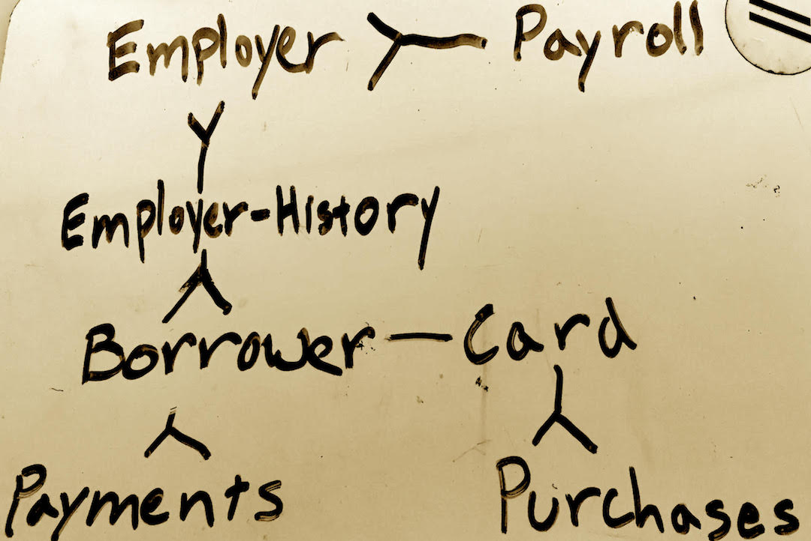

**credi_licious** - Extending credit to the well employed

The idea all started with an observation we made: some people with great income have horrendous credit. Simply, we should provide credit to an underserved group of hardworking Americans. And because we deduct payments from your paycheck, you never have to worry about making ends meet: we give you the flexibility to meet your lifestyle.

**User Stories**
Borrower requests credit line from the lender (credi_licious).
	- borrower sends payroll permission to send income
	- historical monthly income

Lender approves or disproves a line of credit
	- an amount of credit
	- based on a formula of historical income

Lender sends borrower physical card
	- card has every transaction
	- accumulate sum of the credit
	- use sum of the credit used
	- count

Lender sends payroll office request for cash monthly
	-payroll office
	- this amount based on borrower settings

**DB Architecture**

